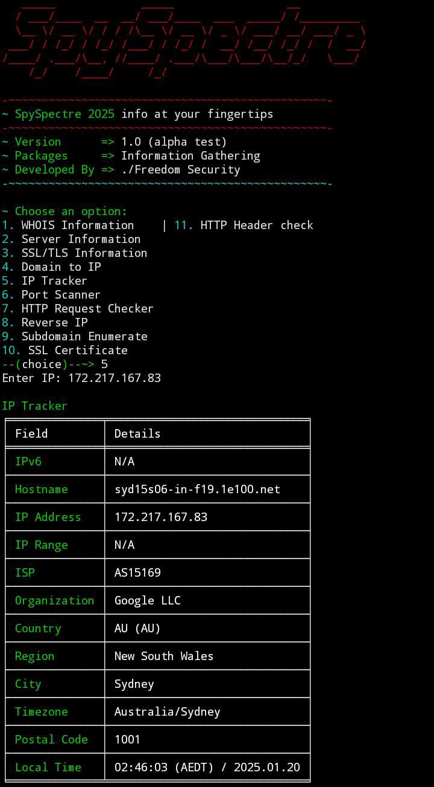

# SpySpectre 2025



**SpySpectre 2025** is a powerful Information Gathering tool, built to provide valuable data and insights about domains, IPs, SSL certificates, and more. This tool is designed to help security professionals, researchers, and pentesters gather detailed information about their target systems.

## 🚀 Features

SpySpectre offers a variety of features for gathering information about domains and IP addresses:

### 1. **WHOIS Information**
   - Retrieve WHOIS information about a domain, including registrar, creation and expiration dates, and name servers.

### 2. **Server Information**
   - Obtain server information, including HTTP headers and server software.

### 3. **SSL/TLS Information**
   - Check SSL/TLS certificate details for secure domains.

### 4. **Domain to IP**
   - Convert a domain name into its corresponding IP address.

### 5. **IP Tracker**
   - Track IP addresses, get geolocation data, and more.

### 6. **Port Scanner**
   - Scan a list of ports on a domain to check for open/closed ports.

### 7. **HTTP Request Checker**
   - Check the response of an HTTP request for any domain using various methods (GET, POST, PUT, etc.).

### 8. **Reverse IP Lookup**
   - Perform a reverse IP lookup to find all domains hosted on the same IP.

### 9. **Subdomain Enumeration**
   - Enumerate subdomains of a target domain and retrieve their associated IP addresses.

### 10. **SSL Certificate Information**
   - Check SSL certificate information and validity dates for secure domains.

### 11. **HTTP Header Check**
   - Retrieve HTTP headers for a domain, including content type, server info, and more.

---

## 🛠️ Installation

### Requirements

Make sure you have Python 3.x installed. You can check it with:

```bash
python --version
```

Install the required dependencies by running the following command:

```bash
pip install -r lib.txt
```

This will install all necessary libraries listed in `lib.txt`.

### Running the Script

Once dependencies are installed, you can run the script with the following command:

```bash
python main.py
```

If you're using Python 3, you might need to run:

```bash
python3 main.py
```

---

## 📜 Usage

Upon running the script, you will be presented with a menu of options. You can select an option by entering the corresponding number.

Example:

1. WHOIS Information  
2. Server Information  
3. SSL/TLS Information  
4. Domain to IP  
5. IP Tracker  
6. Port Scanner  
7. HTTP Request Checker  
8. Reverse IP  
9. Subdomain Enumerate  
10. SSL Certificate  
11. HTTP Header Check

Select an option and provide the required input when prompted. ( choose 1/2/3 and more )

---


